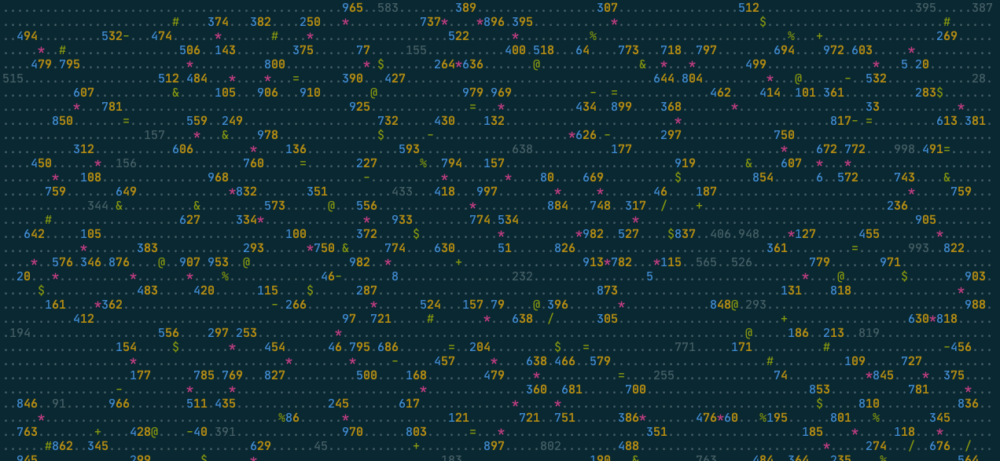

# Day 03

Loops all the way down.

I'm probably eating up memory with these objects, but I really like the clarity of modelling each cell as a little object - it then means that processing the grid, and using `kleur` to make a pretty-printed terminal output:

made for an excellent debugging approach. As I added functionality, I added colors, till I got somewhere I was happy with.
